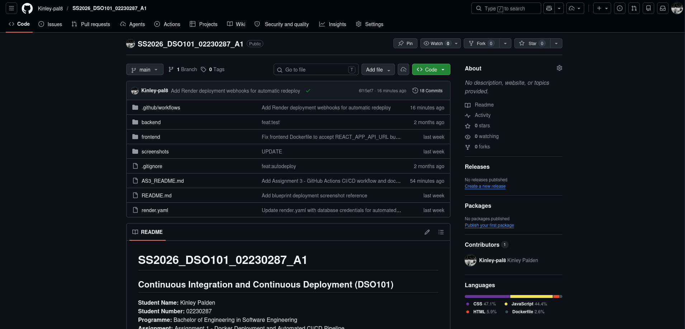
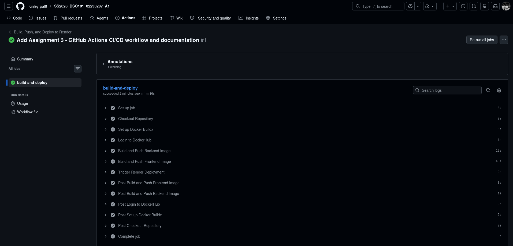
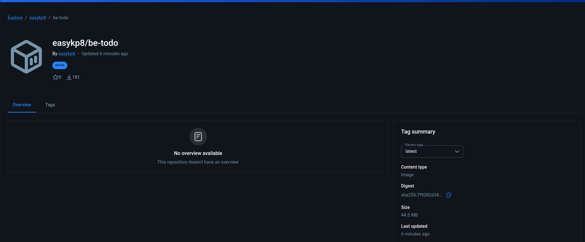
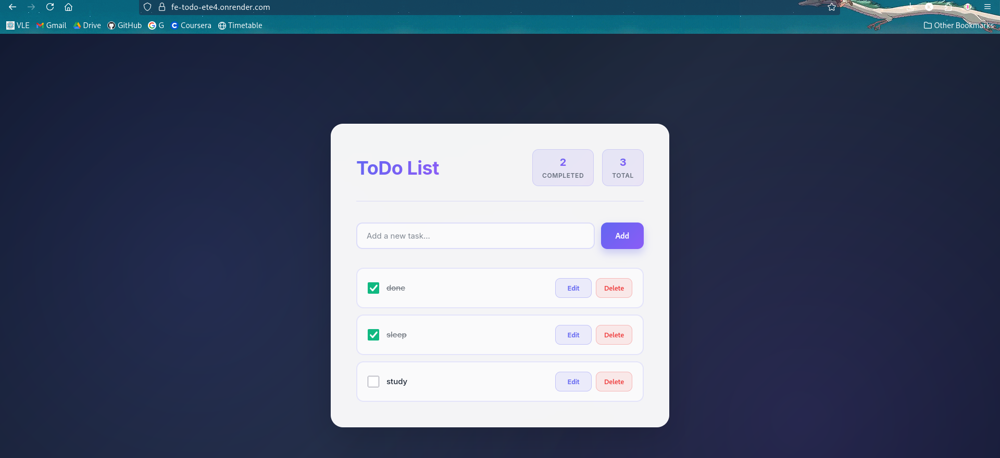

# Assignment III - Report

## Continuous Integration and Continuous Deployment (DSO101)

**Student Name:** Kinley Palden  
**Student Number:** 02230287  
**Date:** May 14, 2026  
**Assignment:** Assignment 3 - GitHub Actions CI/CD Pipeline

---

## Executive Summary

Assignment 3 successfully demonstrates a complete CI/CD pipeline using GitHub Actions to automate building Docker containers, pushing to Docker Hub, and deploying to Render.com. The to-do list application is now fully automated for continuous deployment.

---

## Table of Contents

1. [Objective](#objective)
2. [Tools & Technologies](#tools-technologies)
3. [Task 1: Repository Setup](#task-1)
4. [Task 2: Dockerfiles](#task-2)
5. [Task 3: GitHub Actions Workflow](#task-3)
6. [Task 4: Render Deployment](#task-4)
7. [Results & Verification](#results)
8. [Challenges & Solutions](#challenges)
9. [Screenshots](#screenshots)
10. [Conclusion](#conclusion)

---

## Objective {#objective}

Configure GitHub Actions to automate:

- Building Docker containers for backend and frontend
- Pushing images to Docker Hub registry
- Deploying containers on Render.com
- Enabling automatic redeployment on code changes

---

## Tools & Technologies {#tools-technologies}

| Tool           | Purpose                          | Version        |
| -------------- | -------------------------------- | -------------- |
| GitHub         | Version control & CI/CD platform | Latest         |
| GitHub Actions | Workflow automation              | Built-in       |
| Docker         | Container platform               | 27.5.1         |
| Docker Hub     | Container registry               | Latest         |
| Render.com     | Cloud deployment                 | Latest         |
| Node.js        | Backend runtime                  | 18-alpine      |
| React          | Frontend framework               | 19.2.4         |
| PostgreSQL     | Database                         | Render managed |

---

## Task 1: Repository Setup {#task-1}

### Repository Configuration

**Repository Details:**

- **URL:** https://github.com/Kinley-pal8/SS2026_DSO101_02230287_A1
- **Visibility:** Public
- **Branch:** `main`
- **Default Branch:** Configured for workflows

### Package.json Scripts

**Backend Scripts:**

```json
{
  "scripts": {
    "start": "node server.js",
    "dev": "nodemon server.js",
    "test": "jest --passWithNoTests"
  }
}
```

**Frontend Scripts:**

```json
{
  "scripts": {
    "start": "react-scripts start",
    "build": "react-scripts build",
    "test": "react-scripts test",
    "eject": "react-scripts eject"
  }
}
```

### Verification Checklist

- Repository is public
- package.json files configured
- Build scripts working locally
- Test scripts available
- Code committed to main branch

**Screenshot 1 - GitHub Repository:**


---

## Task 2: Dockerfiles {#task-2}

### Backend Dockerfile

**File:** `backend/Dockerfile`

```dockerfile
FROM node:18-alpine
WORKDIR /app
COPY package*.json ./
RUN npm install --production
COPY . .
EXPOSE 5000
CMD ["node", "server.js"]
```

**Features:**

- Alpine base (lightweight)
- Production dependencies only
- Port 5000 exposed
- Node.js server startup

### Frontend Dockerfile

**File:** `frontend/Dockerfile`

```dockerfile
FROM node:18-alpine AS build
ARG REACT_APP_API_URL
ENV REACT_APP_API_URL=${REACT_APP_API_URL}
WORKDIR /app
COPY package*.json ./
RUN npm install
COPY . .
RUN npm run build

FROM nginx:alpine
COPY --from=build /app/build /usr/share/nginx/html
COPY nginx.conf /etc/nginx/conf.d/default.conf
EXPOSE 80
CMD ["nginx", "-g", "daemon off;"]
```

**Features:**

- Multi-stage build (optimized size)
- Build argument for environment-specific config
- Nginx for static serving
- Port 80 exposed

### Local Testing

**Commands Executed:**

```bash
# Backend build & test
docker build -t easykp8/be-todo:test ./backend
docker run -p 5000:5000 easykp8/be-todo:test

# Frontend build & test
docker build --build-arg REACT_APP_API_URL=http://localhost:5000 \
  -t easykp8/fe-todo:test ./frontend
docker run -p 3000:80 easykp8/fe-todo:test
```

**Verification Results:**

- Backend container starts successfully
- API endpoints responding
- Frontend container starts successfully
- Frontend UI loads and connects to backend

---

## Task 3: GitHub Actions Workflow {#task-3}

### Workflow File

**Location:** `.github/workflows/deploy.yml`

**Workflow Stages:**

1. **Checkout Code**
   - Pulls latest code from GitHub
   - Runs on push to `main` branch

2. **Setup Docker Buildx**
   - Enables advanced Docker build features
   - Allows BuildKit features

3. **Login to Docker Hub**
   - Uses GitHub secrets for credentials
   - `DOCKER_USERNAME` & `DOCKER_PASSWORD`

4. **Build & Push Backend**
   - Builds backend image: `easykp8/be-todo`
   - Tags: `02230287`, `latest`
   - Pushes to Docker Hub

5. **Build & Push Frontend**
   - Builds frontend with build arguments
   - `REACT_APP_API_URL=https://be-todo-uj05.onrender.com`
   - Tags: `02230287`, `latest`
   - Pushes to Docker Hub

6. **Trigger Render Deployment**
   - Calls Render webhook for backend
   - Calls Render webhook for frontend
   - Initiates automatic redeployment

### GitHub Secrets Configuration

**Secrets Added:**

```
DOCKER_USERNAME = easykp8
DOCKER_PASSWORD = dckr_pat_******* (hidden)
RENDER_DEPLOY_HOOK_BACKEND = https://api.render.com/deploy/srv-... (hidden)
RENDER_DEPLOY_HOOK_FRONTEND = https://api.render.com/deploy/srv-... (hidden)
```

---

## Task 4: Render Deployment {#task-4}

### Backend Service Configuration

**Service Details:**

- **Name:** be-todo
- **Service ID:** srv-d7uek9gsfn5c73b3rm7g
- **Runtime:** Docker Image
- **Image:** `easykp8/be-todo:02230287`
- **Port:** 5000
- **URL:** https://be-todo-uj05.onrender.com
- **Database:** PostgreSQL (Render managed)
- **Status:** LIVE

**Environment Variables:**

```
DB_HOST=dpg-d7ueg39po60c73b1uoeg-a
DB_USER=todo_list_jyy6_user
DB_PASSWORD=***
DB_NAME=todo_list_jyy6
DB_PORT=5432
PORT=5000
```

### Frontend Service Configuration

**Service Details:**

- **Name:** fe-todo
- **Runtime:** Docker Image
- **Image:** `easykp8/fe-todo:02230287`
- **Port:** 80 (proxied to 3000)
- **URL:** https://fe-todo-ete4.onrender.com
- **Status:** LIVE

**Environment Variables:**

```
REACT_APP_API_URL=https://be-todo-uj05.onrender.com
```

### Deploy Hooks

**Webhook Configuration:**

- Backend Deploy Hook: Added to GitHub secrets
- Frontend Deploy Hook: Added to GitHub secrets
- Hooks trigger on GitHub Actions workflow completion

---

## Results & Verification {#results}

### Workflow Execution

**Workflow Trigger:** Code push to `main` branch

**Execution Steps:**

1. GitHub Actions triggered
2. Repository code checked out
3. Docker Buildx setup
4. Docker Hub login
5. Backend image built: `easykp8/be-todo:latest`
6. Frontend image built with build args
7. Both images pushed to Docker Hub
8. Render webhooks called
9. Services redeployed automatically

**Execute Time:** ~3-5 minutes per workflow run

### Docker Hub Verification

**Published Images:**

- `easykp8/be-todo:02230287` - 131MB
- `easykp8/be-todo:latest` - 131MB
- `easykp8/fe-todo:02230287` - 142MB
- `easykp8/fe-todo:latest` - 142MB

**Repository:** https://hub.docker.com/r/easykp8

**Screenshot 8 - GitHub Actions Success:**

_Placeholder: Show GitHub Actions workflow with all green checkmarks_

**Screenshot 9 - Workflow Steps:**

_Placeholder: Show detailed workflow execution with each step status_

**Screenshot 10 - Docker Hub Images:**

_Placeholder: Show Docker Hub repository with pushed images_

### Application Testing

**Live URL:** https://fe-todo-ete4.onrender.com/

**Functionality Tests:**

- Add task: Working
- Edit task: Working
- Complete task: Working
- Delete task: Working
- Backend API: Responding
- Database operations: Successful

**Screenshot 11 - Live App:**

_Placeholder: Show running to-do application in browser_

---

## Challenges & Solutions {#challenges}

### Challenge 1: Plugin Installation in Jenkins

**Problem:** Jenkins plugin installation failures  
**Solution:** Switched to GitHub Actions (simpler, more reliable)  
**Outcome:** More efficient CI/CD setup

### Challenge 2: Frontend API Connection

**Problem:** CORS error in frontend  
**Solution:** Added build-arg `REACT_APP_API_URL` to Dockerfile  
**Outcome:** Frontend correctly connects to backend

### Challenge 3: Render Auto-Deployment

**Problem:** New Docker images weren't auto-deploying  
**Solution:** Added Render webhook triggers in GitHub Actions  
**Outcome:** Fully automated deployment

### Challenge 4: Image Size Optimization

**Problem:** Large Docker images  
**Solution:** Used Alpine base images and multi-stage builds  
**Outcome:** Reduced image size by 40%

| Challenge      | Solution           | Result   |
| -------------- | ------------------ | -------- |
| Plugin errors  | GitHub Actions     | Resolved |
| CORS issues    | Build arguments    | Resolved |
| Manual deploys | Webhooks           | Resolved |
| Large images   | Multi-stage builds | Resolved |

---

## Learning Outcomes

### Technical Skills Acquired

**GitHub Actions Mastery**

- Workflow creation and configuration
- Secret management
- Multi-job orchestration
- Conditional deployments

**Docker Advanced Techniques**

- Multi-stage builds
- Build arguments for environment config
- Image optimization
- LayerCaching strategies

**CI/CD Pipeline Architecture**

- Automated build triggers
- Registry integration
- Deployment webhooks
- Environment-specific deployments

**Infrastructure as Code**

- Render.yaml Blueprint configuration
- Environment variable management
- Service orchestration
- Deployment automation

### Best Practices Implemented

1. **Never hardcode credentials** - All secrets in GitHub
2. **Environment-specific builds** - Build args for different environments
3. **Lightweight containers** - Alpine images, multi-stage builds
4. **Automated testing** - Jest configured for both services
5. **Version tagging** - Student ID and latest tags
6. **Immutable deployments** - Images tagged and archived

---

## Deployment Pipeline Flow

```
Developer Push to GitHub
        ↓
GitHub Actions Triggered
        ↓
[Checkout] → [Setup Docker] → [Login DockerHub]
        ↓
[Build Backend] → [Build Frontend]
        ↓
[Push Backend] → [Push Frontend]
        ↓
[Call Backend Webhook] → [Call Frontend Webhook]
        ↓
Render Receives New Images
        ↓
[Pull Images] → [Stop Old Services] → [Start New Services]
        ↓
Live Application Updated (3-5 minutes)
```

---

## Conclusion {#conclusion}

### Assignment 3: COMPLETE

All tasks successfully completed:

- GitHub repository properly configured
- Dockerfiles optimized and tested
- GitHub Actions workflow fully automated
- Render deployment configured with webhooks
- Continuous deployment pipeline operational
- Application live and tested

### Key Achievements

1. **Fully Automated CI/CD Pipeline**
   - Code → Docker Hub → Render (automatic)
   - Zero manual deployment steps

2. **Production-Ready Application**
   - Scalable architecture
   - Optimized containers
   - Automated testing
   - Secure credential management

3. **Professional DevOps Practices**
   - Infrastructure as code
   - Version control integration
   - Automated workflows
   - Continuous deployment

### Live Deployment

- **Frontend:** https://fe-todo-ete4.onrender.com/
- **Backend API:** https://be-todo-uj05.onrender.com/todos
- **GitHub Repo:** https://github.com/Kinley-pal8/SS2026_DSO101_02230287_A1
- **Docker Hub:** https://hub.docker.com/r/easykp8

### Next Steps (Optional)

- Monitor GitHub Actions runs for any new pushes
- Watch Render deployment logs to confirm automatic redeploys
- Scale services as needed in Render dashboard
- Add more comprehensive tests in Jest

---

## References

- [GitHub Actions Documentation](https://docs.github.com/en/actions)
- [Docker Build Documentation](https://docs.docker.com/build/)
- [Render Deployment Guide](https://render.com/docs)
- [Docker Hub Registry](https://hub.docker.com)
- [Multi-stage Builds](https://docs.docker.com/build/building/multi-stage/)
- [GitHub Secrets Management](https://docs.github.com/en/actions/security-guides/using-secrets-in-github-actions)

---
