# SS2026_DSO101_02230287_A1

## Continuous Integration and Continuous Deployment (DSO101)

**Student Name:** Kinley Palden  
**Student Number:** 02230287  
**Programme:** Bachelor of Engineering in Software Engineering  
**Assignment:** Assignment 1 - Docker Deployment and Automated CI/CD Pipeline

---

## Table of Contents

1. [Step 0 - Prerequisites: Building the To-Do Application](#step-0)
2. [Part A - Deploying a Pre-Built Docker Image to Docker Hub Registry](#part-a)
3. [Part B - Automated Image Build and Deployment](#part-b)

---

## Step 0 - Prerequisites: Building the To-Do Application <a name="step-0"></a>

### Overview

The prerequisite step involved developing a full-stack To-Do web application using React (frontend), Node.js with Express (backend), and PostgreSQL (database). The application supports full CRUD operations — creating, reading, updating, and deleting tasks — and makes use of environment variables for configuration management across different environments.

### Tech Stack

| Layer              | Technology           |
| ------------------ | -------------------- |
| Frontend           | React, Axios         |
| Backend            | Node.js, Express, pg |
| Database           | PostgreSQL           |
| Environment Config | dotenv (.env files)  |

### 1.1 Project Initialisation

The project was initialised with the following directory structure:

```
todo-app/
  /backend
    server.js
    package.json
    Dockerfile
    .env               ← not committed
    .gitignore
  /frontend
    src/
      App.js
      App.css
    Dockerfile
    .env               ← not committed
    .gitignore
  render.yaml
  .gitignore
```

**Screenshot 1 - Backend folder structure at initialisation**

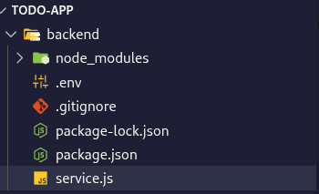

### 1.2 Database Setup

A local PostgreSQL database named `todos_db` was created. The backend was configured to automatically create the `todos` table on startup using the following schema:

```sql
CREATE TABLE IF NOT EXISTS todos (
  id SERIAL PRIMARY KEY,
  task TEXT NOT NULL,
  done BOOLEAN DEFAULT false,
  created_at TIMESTAMP DEFAULT NOW()
);
```

**Screenshot 2 - Backend running (server start)**

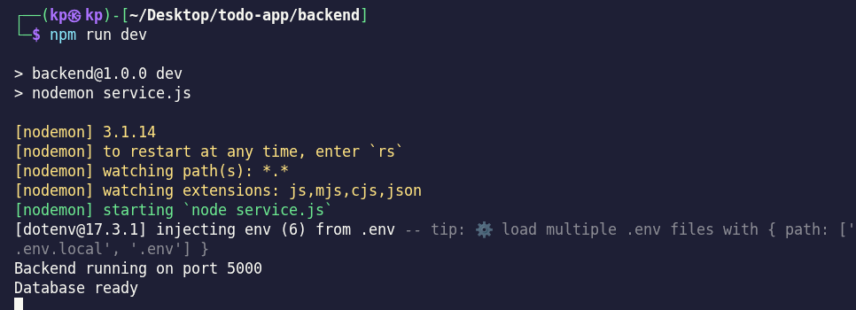

### 1.3 Environment Variable Configuration

Environment variables were configured in `.env` files for both the backend and frontend services. These files were added to `.gitignore` to prevent sensitive credentials from being committed to version control.

**Backend `.env`:**

```
DB_HOST=localhost
DB_USER=postgres
DB_PASSWORD=yourpassword
DB_NAME=todos_db
PORT=5000
```

**Frontend `.env`:**

```
REACT_APP_API_URL=http://localhost:5000
```

### 1.4 Backend API Development

A RESTful CRUD API was developed using Express.js with the following endpoints:

| Method | Endpoint   | Description        |
| ------ | ---------- | ------------------ |
| GET    | /todos     | Retrieve all tasks |
| POST   | /todos     | Create a new task  |
| PUT    | /todos/:id | Update a task      |
| DELETE | /todos/:id | Delete a task      |

**Screenshot 4 - Frontend folder structure at initialisation**

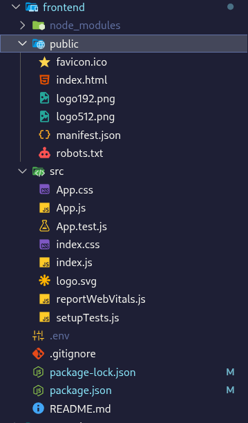

### 1.5 API Endpoint Testing

The API endpoints were tested locally to verify correct functionality before proceeding to containerisation.

**Screenshot 3 - Testing the endpoints of the todos**

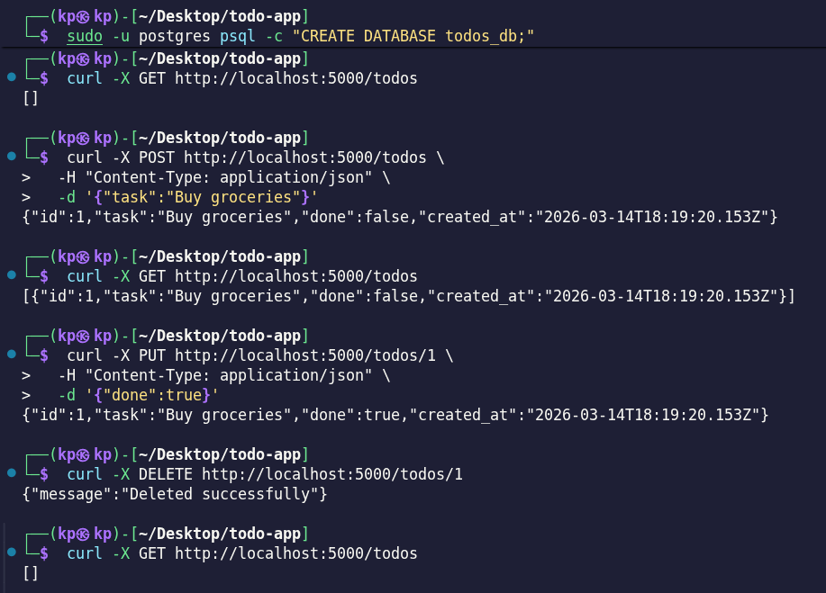

**Screenshot 5 - Frontend running output**

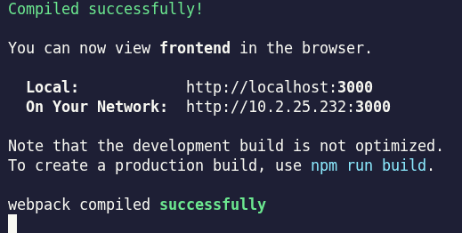

### 1.6 Frontend Development

The React frontend was developed with components for adding, editing, completing, and deleting tasks. The frontend communicates with the backend via Axios using the `REACT_APP_API_URL` environment variable.

**Screenshot 6 & 7 - Frontend running locally in browser and connected with backend, changes reflected between FE and BE**

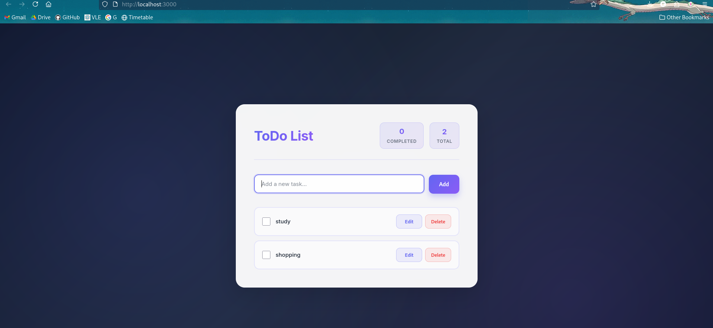

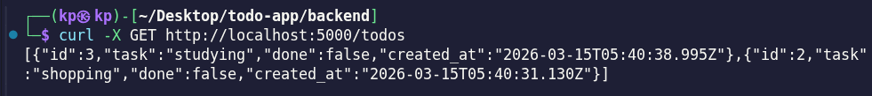

---

## Part A - Deploying a Pre-Built Docker Image to Docker Hub Registry <a name="part-a"></a>

### Overview

Part A involved containerising both the frontend and backend services using Docker, pushing the resulting images to Docker Hub using the student ID as the image tag, and deploying the services on Render.com using pre-built images.

### 2.1 Dockerfile Configuration

Dockerfiles were written for both services. The backend Dockerfile uses `node:18-alpine` as the base image for a lightweight production build. The frontend Dockerfile uses a multi-stage build — first building the React application with Node.js, then serving the static output via an Nginx web server.

**Backend Dockerfile:**

```dockerfile
FROM node:18-alpine
WORKDIR /app
COPY package*.json ./
RUN npm install --production
COPY . .
EXPOSE 5000
CMD ["node", "server.js"]
```

**Frontend Dockerfile:**

```dockerfile
FROM node:18-alpine AS build
WORKDIR /app
COPY package*.json ./
RUN npm install
COPY . .
RUN npm run build

FROM nginx:alpine
COPY --from=build /app/build /usr/share/nginx/html
COPY nginx.conf /etc/nginx/conf.d/default.conf
EXPOSE 80
CMD ["nginx", "-g", "daemon off;"]
```

### 2.2 Building and Pushing the Backend Image

The backend Docker image was built and pushed to Docker Hub using the student ID `02230287` as the image tag.

```bash
docker build -t easykp8/be-todo:02230287 .
docker push easykp8/be-todo:02230287
```

**Screenshot 8 - Docker build of backend and push**

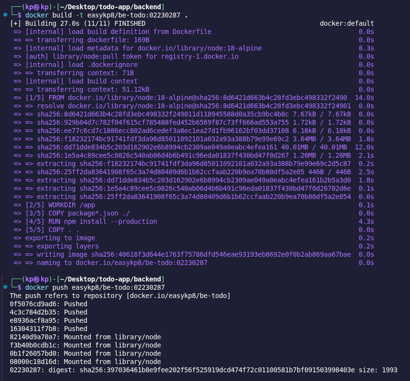

**Screenshot 9 - Docker build and push for frontend**

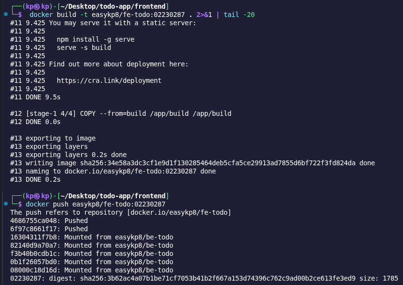

### 2.3 Building and Pushing the Frontend Image

The frontend Docker image was similarly built and pushed to Docker Hub.

```bash
docker build -t easykp8/fe-todo:02230287 .
docker push easykp8/fe-todo:02230287
```

**Screenshot 10 - Environment variables for the todo database**

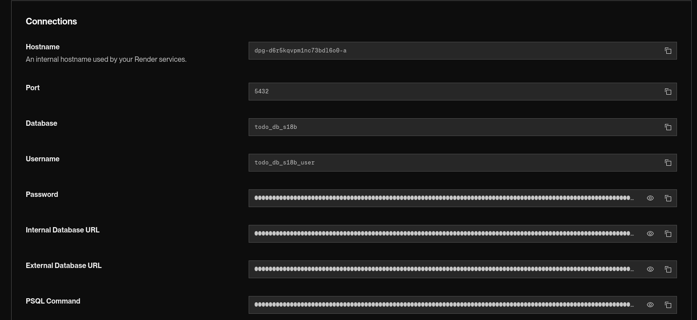

### 2.4 Database Provisioning on Render

A managed PostgreSQL database was provisioned on Render.com. The connection credentials (host, username, password, and database name) were retrieved from the Render dashboard for use in the backend service configuration.

**Screenshot 11 - Backend deployed in Render and showing [] in the browser**

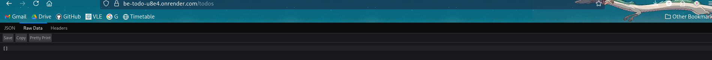

**Screenshot 12 - Backend deployed in Render, browser output**

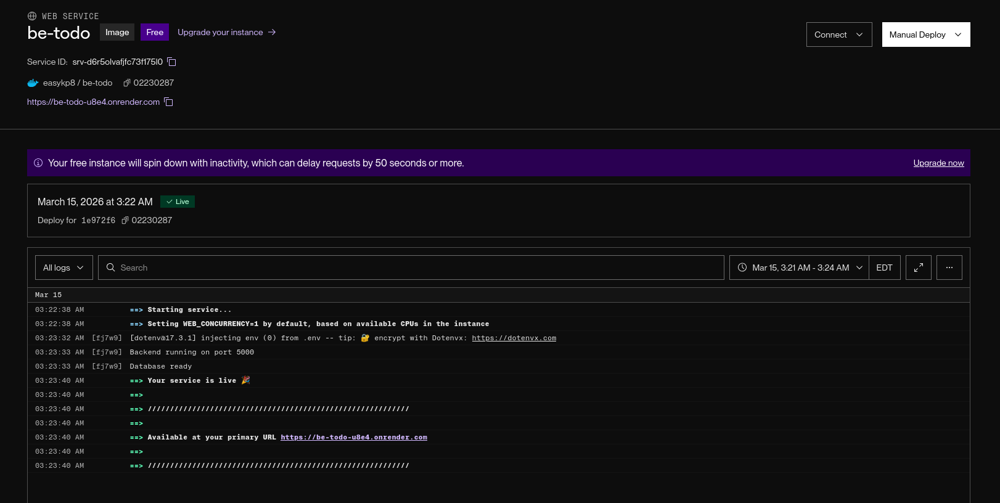

### 2.6 Frontend Deployment on Render

The frontend service was deployed using the pre-built image, with the `REACT_APP_API_URL` environment variable pointing to the live backend service URL.

- **Image:** `easykp8/fe-todo:02230287`
- **Environment Variables:** `REACT_APP_API_URL=https://be-todo-u8e4.onrender.com`
- **Live URL:** `https://fe-todo-6ip1.onrender.com`

**Screenshot 13 - Frontend deployed in Render and showing [] in the browser**

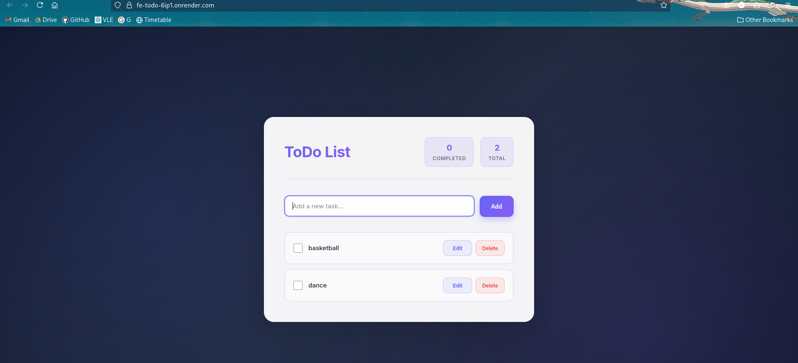

**Screenshot 14 - Frontend deployed in Render, browser output**

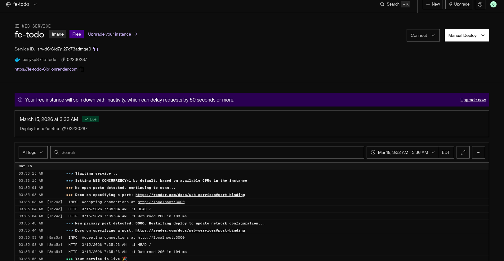

---

## Part B - Automated Image Build and Deployment <a name="part-b"></a>

### Overview

Part B involved configuring an automated CI/CD pipeline whereby any new commit pushed to the GitHub repository triggers an automatic rebuild and redeployment of both services on Render. This was achieved by connecting Render services directly to the GitHub repository and configuring a `render.yaml` Blueprint specification file.

### 3.1 Repository Structure

The repository was structured as follows to support multi-service automated deployment:

```
todo-app/
  /frontend
    Dockerfile
    .env.production
  /backend
    Dockerfile
    .env.production
  render.yaml
  .gitignore
```

### 3.2 render.yaml Configuration

A `render.yaml` Blueprint file was created at the root of the repository to define the multi-service deployment configuration. This file instructs Render to build Docker images directly from the repository's Dockerfiles upon each new commit.

```yaml
services:
  - type: web
    name: be-todo-auto
    env: docker
    dockerfilePath: ./backend/Dockerfile
    envVars:
      - key: DB_HOST
        sync: false
      - key: DB_USER
        sync: false
      - key: DB_PASSWORD
        sync: false
      - key: DB_NAME
        sync: false
      - key: DB_PORT
        value: 5432
      - key: PORT
        value: 5000

  - type: web
    name: fe-todo-auto
    env: docker
    dockerfilePath: ./frontend/Dockerfile
    envVars:
      - key: REACT_APP_API_URL
        sync: false
```

The `sync: false` directive was used for sensitive environment variables to ensure credentials are managed securely through the Render dashboard rather than being stored in the repository.

### 3.3 GitHub Repository Setup

The project was pushed to a GitHub repository named `SS2026_DSO101_02230287_A1`. The `.gitignore` was configured to exclude all `.env` files and `node_modules` directories, ensuring no sensitive information was committed.

**Screenshot 15 - Auto deploy for backend (Render dashboard)**

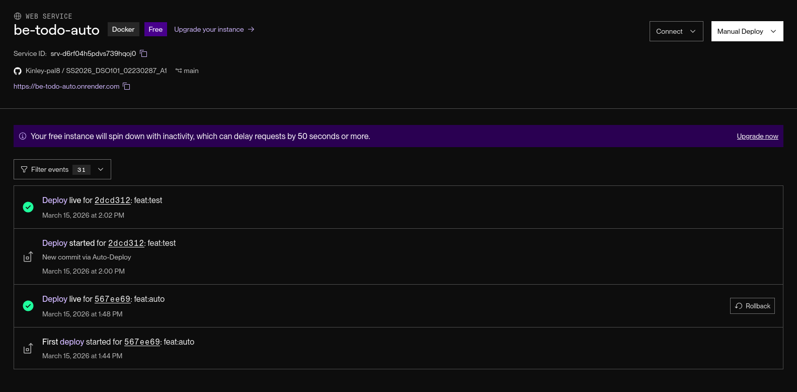

**Screenshot 16 - Auto deploy for frontend (Render dashboard)**

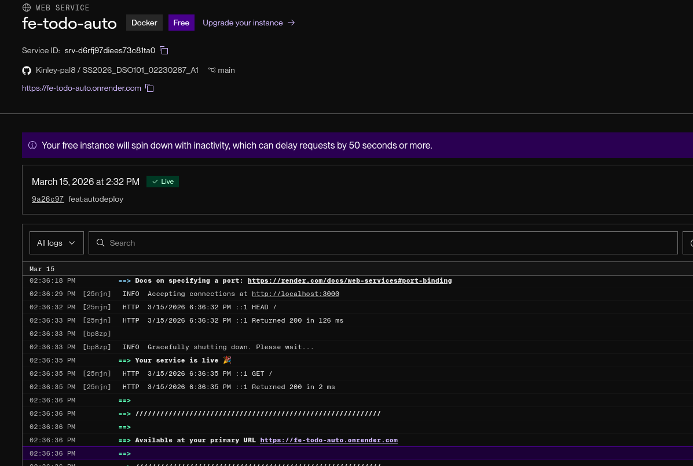

**Screenshot 17 - render.yaml file**

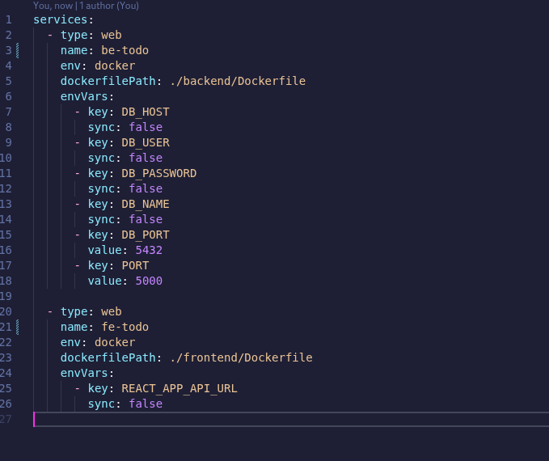

### 3.6 Auto-Deploy Verification

To verify the automated deployment pipeline, a commit was pushed to the repository and the Render dashboard was monitored to confirm that both services automatically triggered a new build and deployment without any manual intervention.

---

## Summary

| Component           | Details                                                    |
| ------------------- | ---------------------------------------------------------- |
| Docker Hub Username | `easykp8`                                                  |                     |               |
| Backend URL  | `https://be-todo-auto.onrender.com`                        |
| Frontend URL | `https://fe-todo-auto.onrender.com`                        |
| GitHub Repository   | `https://github.com/Kinley-pal8/SS2026_DSO101_02230287_A1` |

---

## References

- Docker Documentation: https://docs.docker.com/
- Render Documentation: https://render.com/docs
- Render Blueprint Spec: https://render.com/docs/blueprint-spec
- Render Deploy from Image: https://render.com/docs/deploying-an-image
- Render Environment Variables: https://render.com/docs/configure-environment-variables
